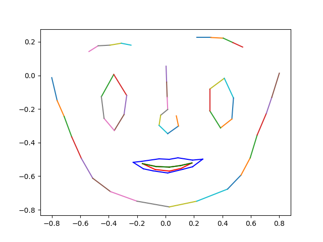
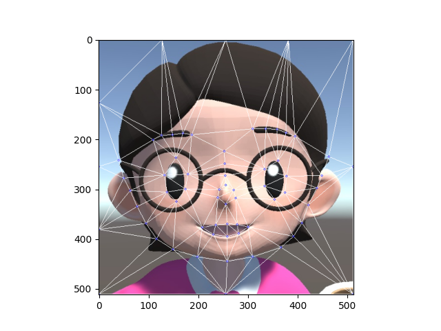

## Run
```
python cartoon_preprocess.py 
参数DEMO_CH用来控制要处理的数据
```
### The format of the data is as follows
#### LMK
```text
<points label="1" source="manual" outside="0" occluded="0" points="369.78,388.10">
<points label="2" source="manual" outside="0" occluded="0" points="379.86,427.47">
<points label="3" source="manual" outside="0" occluded="0" points="393.17,454.33">
<points label="4" source="manual" outside="0" occluded="0" points="407.22,488.07">
<points label="5" source="manual" outside="0" occluded="0" points="426.32,524.85">
<points label="6" source="manual" outside="0" occluded="0" points="448.46,558.13">
<points label="7" source="manual" outside="0" occluded="0" points="483.18,580.96">
<points label="8" source="manual" outside="0" occluded="0" points="534.91,598.21">
<points label="9" source="manual" outside="0" occluded="0" points="598.51,608.25">
<points label="10" source="manual" outside="0" occluded="0" points="653.49,599.21">
<points label="11" source="manual" outside="0" occluded="0" points="713.97,580.47">
<points label="12" source="manual" outside="0" occluded="0" points="741.29,556.90">
<points label="13" source="manual" outside="0" occluded="0" points="759.73,528.51">
<points label="14" source="manual" outside="0" occluded="0" points="774.77,490.24">
<points label="15" source="manual" outside="0" occluded="0" points="793.24,454.69">
<points label="16" source="manual" outside="0" occluded="0" points="804.04,427.34">
<points label="17" source="manual" outside="0" occluded="0" points="819.38,387.48">
<points label="18" source="manual" outside="0" occluded="0" points="443.84,345.94">
<points label="19" source="manual" outside="0" occluded="0" points="461.42,336.99">
<points label="20" source="manual" outside="0" occluded="0" points="485.51,336.15">
<points label="21" source="manual" outside="0" occluded="0" points="508.04,333.19">
<points label="22" source="manual" outside="0" occluded="0" points="526.73,336.07">
<points label="23" source="manual" outside="0" occluded="0" points="657.41,324.97">
<points label="24" source="manual" outside="0" occluded="0" points="685.20,326.32">
<points label="25" source="manual" outside="0" occluded="0" points="708.92,327.12">
<points label="26" source="manual" outside="0" occluded="0" points="728.34,335.09">
<points label="27" source="manual" outside="0" occluded="0" points="747.59,342.71">
<points label="28" source="manual" outside="0" occluded="0" points="595.54,372.35">
<points label="29" source="manual" outside="0" occluded="0" points="596.73,398.97">
<points label="30" source="manual" outside="0" occluded="0" points="596.85,424.44">
<points label="31" source="manual" outside="0" occluded="0" points="597.93,444.94">
<points label="32" source="manual" outside="0" occluded="0" points="583.78,454.89">
<points label="33" source="manual" outside="0" occluded="0" points="579.90,471.47">
<points label="34" source="manual" outside="0" occluded="0" points="597.45,485.56">
<points label="35" source="manual" outside="0" occluded="0" points="618.22,473.62">
<points label="36" source="manual" outside="0" occluded="0" points="614.35,455.96">
<points label="37" source="manual" outside="0" occluded="0" points="467.12,421.95">
<points label="38" source="manual" outside="0" occluded="0" points="492.10,385.38">
<points label="39" source="manual" outside="0" occluded="0" points="516.99,420.42">
<points label="40" source="manual" outside="0" occluded="0" points="511.46,452.14">
<points label="41" source="manual" outside="0" occluded="0" points="492.09,479.07">
<points label="42" source="manual" outside="0" occluded="0" points="471.63,458.03">
<points label="43" source="manual" outside="0" occluded="0" points="681.66,411.89">
<points label="44" source="manual" outside="0" occluded="0" points="710.22,394.17">
<points label="45" source="manual" outside="0" occluded="0" points="727.68,427.29">
<points label="46" source="manual" outside="0" occluded="0" points="724.08,463.12">
<points label="47" source="manual" outside="0" occluded="0" points="701.87,478.07">
<points label="48" source="manual" outside="0" occluded="0" points="681.29,448.85">
<points label="49" source="manual" outside="0" occluded="0" points="527.97,532.49">
<points label="50" source="manual" outside="0" occluded="0" points="546.00,522.65">
<points label="51" source="manual" outside="0" occluded="0" points="580.27,513.42">
<points label="52" source="manual" outside="0" occluded="0" points="599.52,512.77">
<points label="53" source="manual" outside="0" occluded="0" points="616.96,512.34">
<points label="54" source="manual" outside="0" occluded="0" points="646.24,523.15">
<points label="55" source="manual" outside="0" occluded="0" points="665.69,529.76">
<points label="56" source="manual" outside="0" occluded="0" points="645.07,549.39">
<points label="57" source="manual" outside="0" occluded="0" points="626.24,558.21">
<points label="58" source="manual" outside="0" occluded="0" points="596.42,566.96">
<points label="59" source="manual" outside="0" occluded="0" points="567.58,561.28">
<points label="60" source="manual" outside="0" occluded="0" points="548.18,551.72">
<points label="61" source="manual" outside="0" occluded="0" points="546.02,534.98">
<points label="62" source="manual" outside="0" occluded="0" points="575.10,529.82">
<points label="63" source="manual" outside="0" occluded="0" points="599.72,528.08">
<points label="64" source="manual" outside="0" occluded="0" points="621.62,529.32">
<points label="65" source="manual" outside="0" occluded="0" points="644.48,534.98">
<points label="66" source="manual" outside="0" occluded="0" points="623.85,549.24">
<points label="67" source="manual" outside="0" occluded="0" points="599.72,555.53">
<points label="68" source="manual" outside="0" occluded="0" points="569.15,549.90">
```
#### img


#### 
| 标准化之后的张嘴数据| 三角形仿射变换|
| ------------- | ------------- |
|   |    |


### inference
```
python drive_cartoon.py --jpg womanteacher.jpg --jpg_bg womanteacher_bg.jpg
```

#### result


